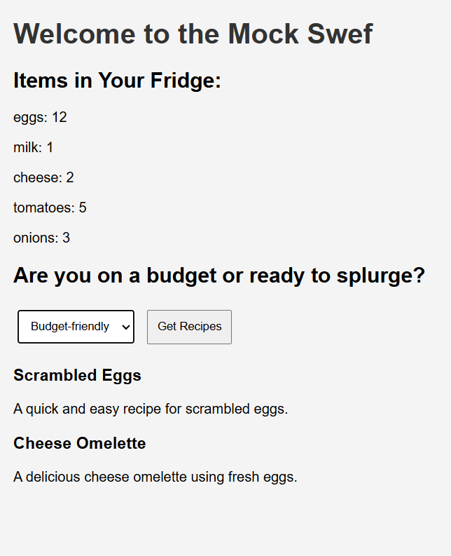

# Swef - Smart Kitchen Assistant 🍳

Welcome to **Swef**, your AI-powered smart kitchen assistant! Swef helps you decide what to cook based on the ingredients you have in your fridge. It considers your budget and suggests recipes accordingly. If you're missing any ingredients, it will list them for easy purchase. Say goodbye to decision fatigue and hello to seamless meal planning!

## Project Overview

- **Backend**: Built with Flask, this is where the magic happens! The backend handles requests, fetches fridge items, and interacts with the AI/ML API for recipe suggestions.
- **Frontend**: The frontend is pretty basic without design, serving as a simple interface to display fridge items and allow users to select their budget.

## Features

- Fetch fridge items from a mock JSON database.
- Suggest recipes based on available ingredients and budget preferences.
- List missing ingredients for easy shopping.

## Getting Started

### Prerequisites

- Python 3.6 or higher
- Flask
- Requests
- Python-dotenv

### Installation

1. Clone the repository:
   ```bash
   git clone https://github.com/yourusername/Swef.git
   cd Swef
   ```

2. Install the required packages:
   ```bash
   pip install Flask requests python-dotenv
   ```

3. Set up your environment variables in a `.env` file:
   ```plaintext
   AI_API_KEY=your_api_key_here
   AI_API_URL=https://api.openai.com/v1/chat/completions
   FLASK_SECRET_KEY=your_secret_key_here
   ```

### Running the Application

1. Start the Flask server:
   ```bash
   cd backend
   flask run
   ```

2. Open your web browser and navigate to:
   ```
   http://127.0.0.1:5000/
   ```

## Screenshot



## Contributing

Feel free to fork the repository and submit pull requests. We welcome contributions to improve the project!

## License

This project is licensed under the MIT License - see the [LICENSE](LICENSE) file for details.

---

Happy cooking! 🍽️
